VLSI Design 65nm process

Inverter Schematic 

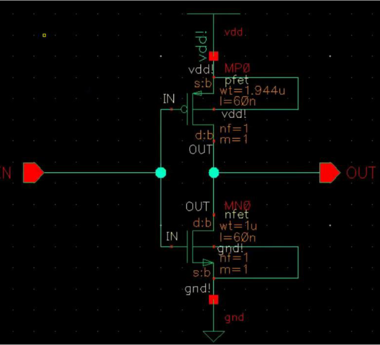

NAND2 Schematic

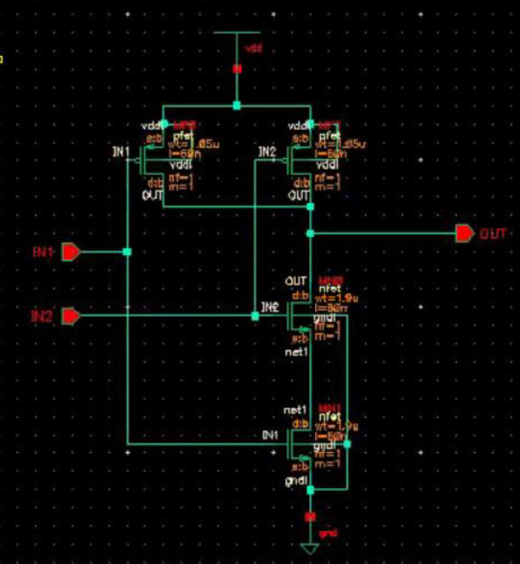

NAND3 Schematic

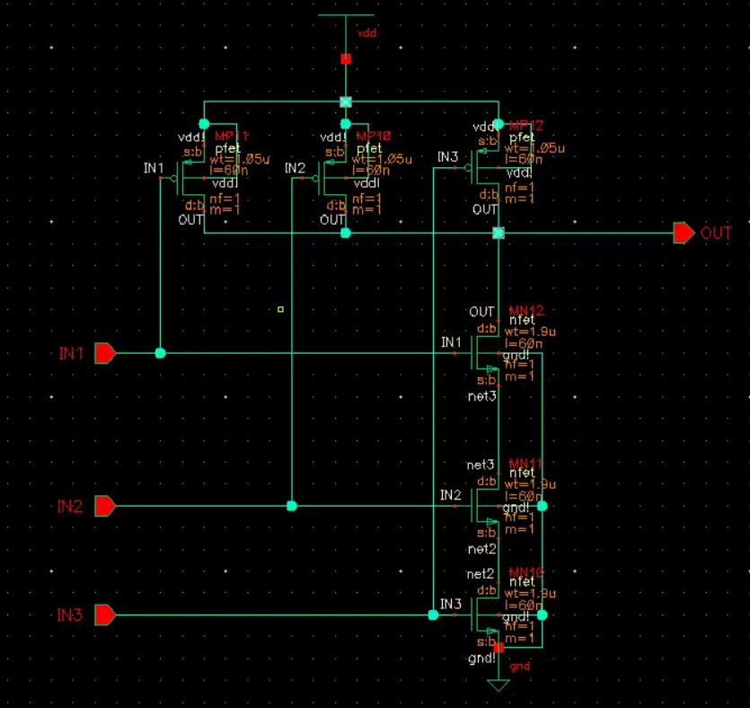

AND2 Schematic

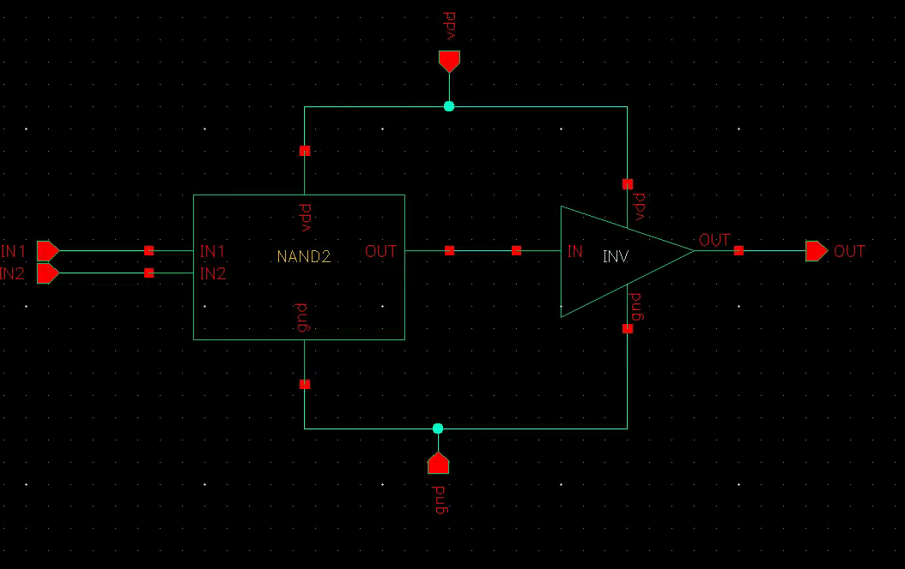

AND2 Output

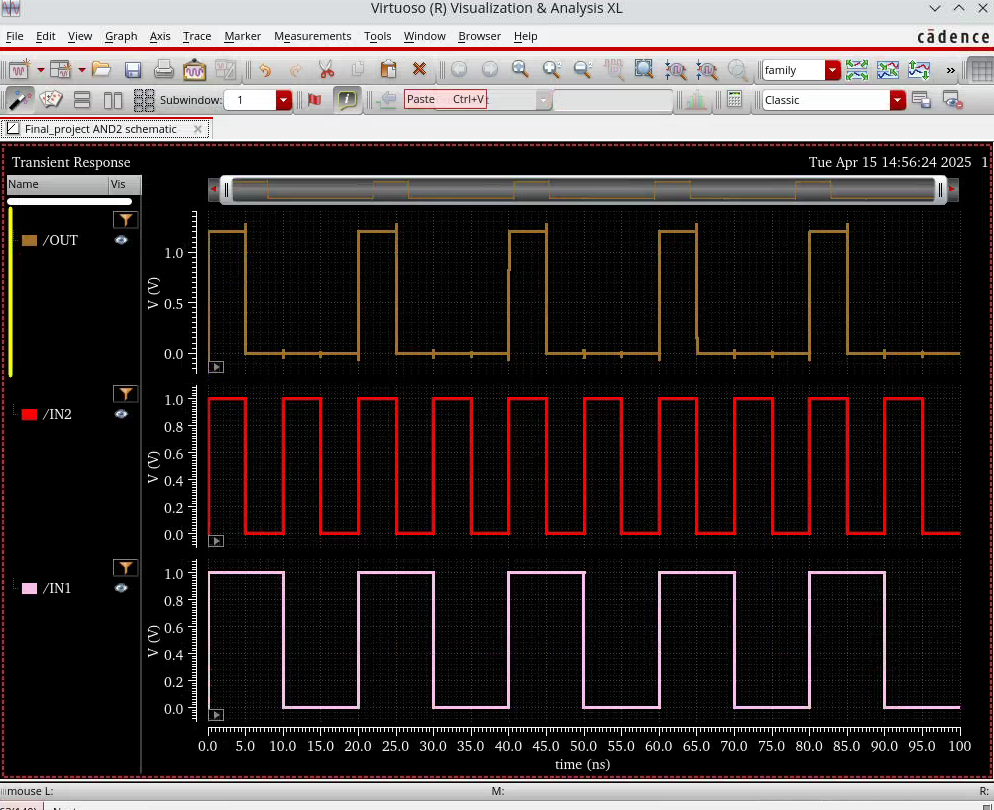

NOR2 Schematic

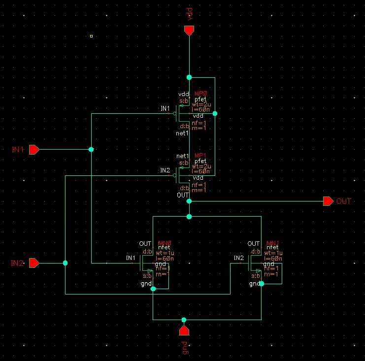

NOR2 Output

XOR Schematic

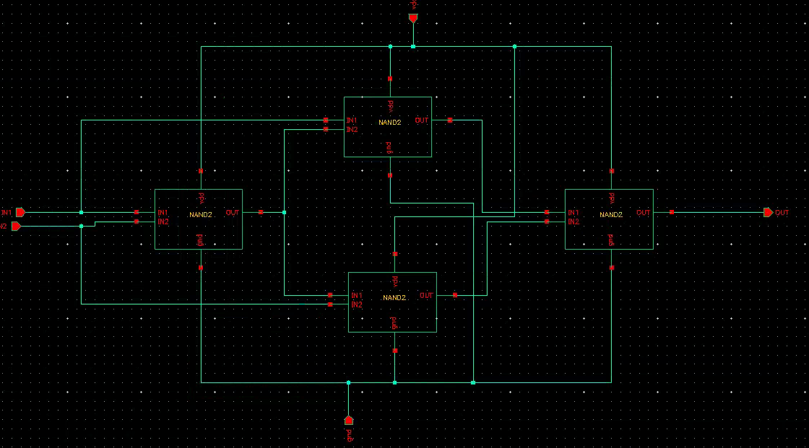

XOR Output

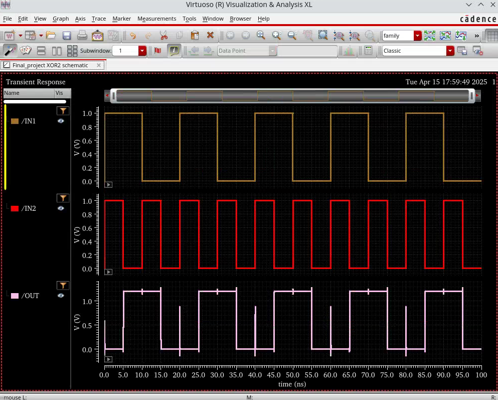

DFF Schematic

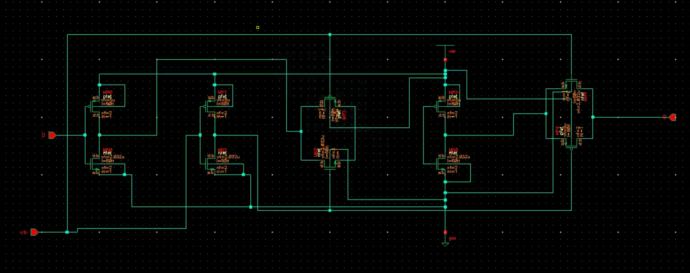

1BIT_FULL_ADDER Schematic

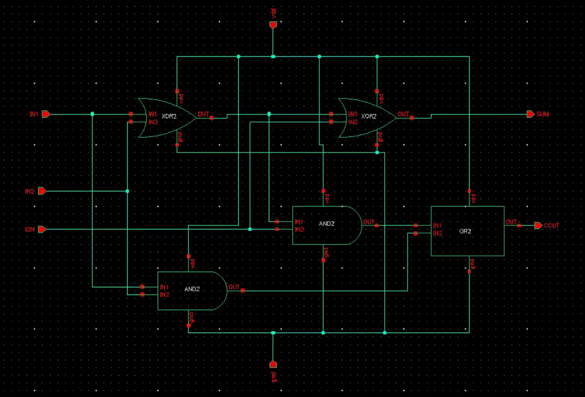

4BIT_ADD_SUB Schematic

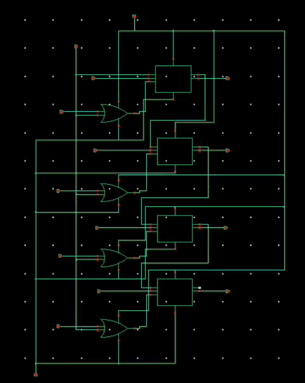

4BIT_ADD_SUB Output

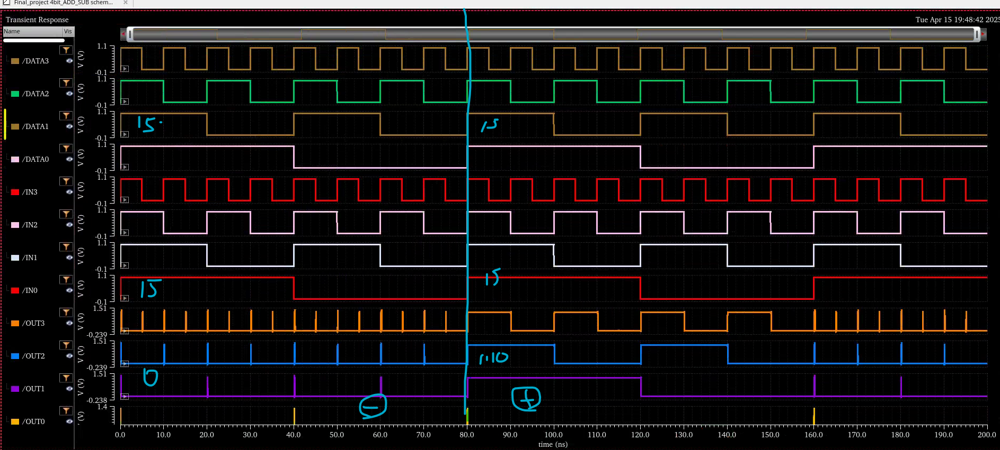
