VLSI Design 65nm process

A – Area
E – Energy (or Energy per operation)
D – Delay (or Performance metric, e.g., latency)
P – Power

Area is related to silicon real estate (gates, LUTs, transistors).

Delay is related to speed (lower delay = faster clock).

Power determines energy efficiency and heat.

Energy = Power × Time (per operation), so it links power and delay.

Inverter Schematic 

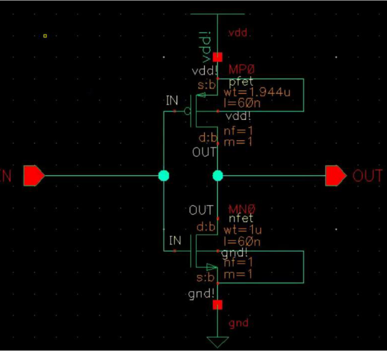

NAND2 Schematic

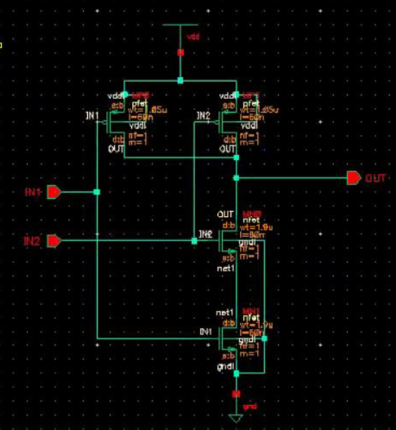

NAND3 Schematic

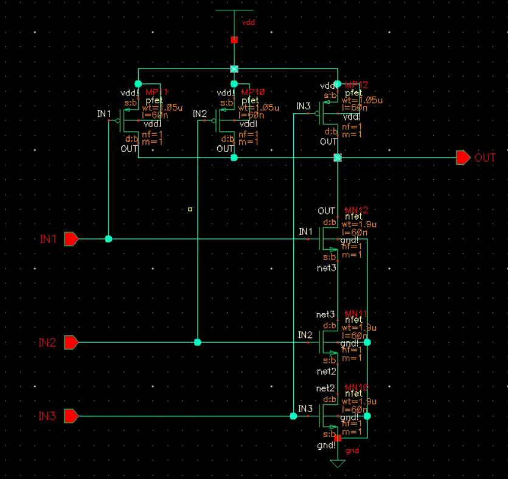

AND2 Schematic

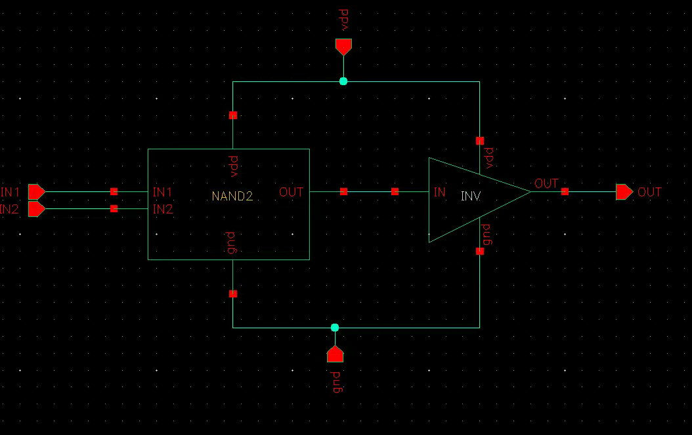

AND2 Output

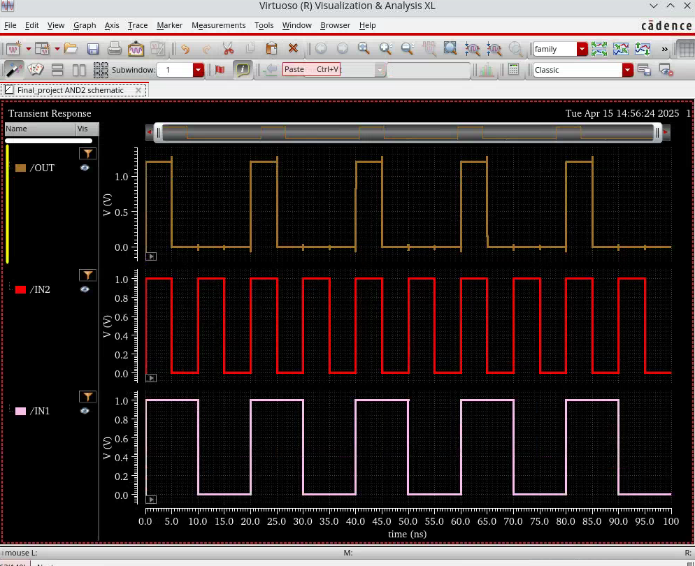

NOR2 Schematic

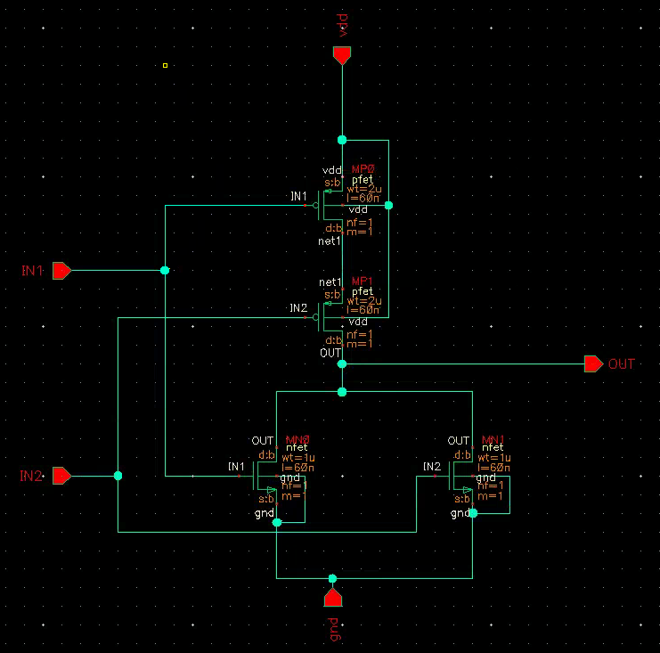

NOR2 Output

XOR Schematic

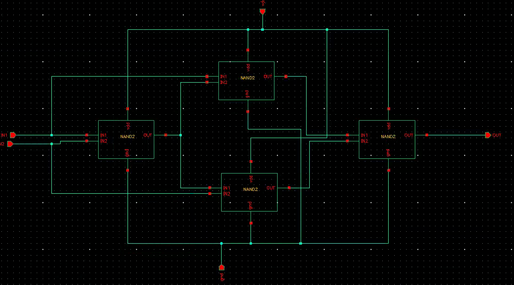

XOR Output

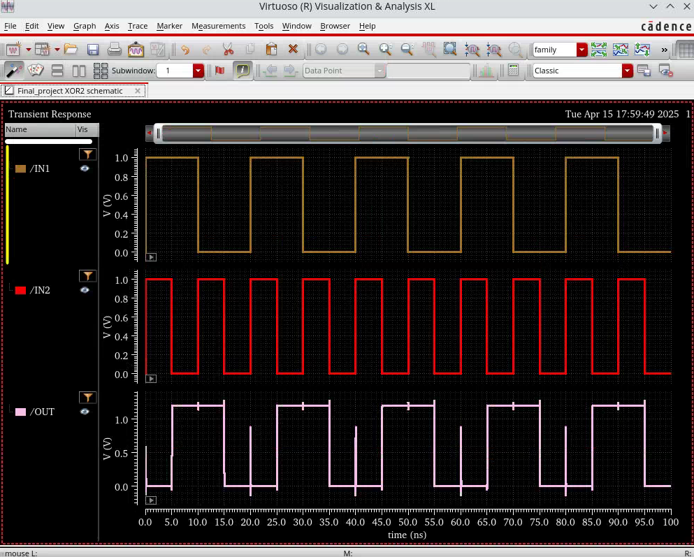

DFF Schematic

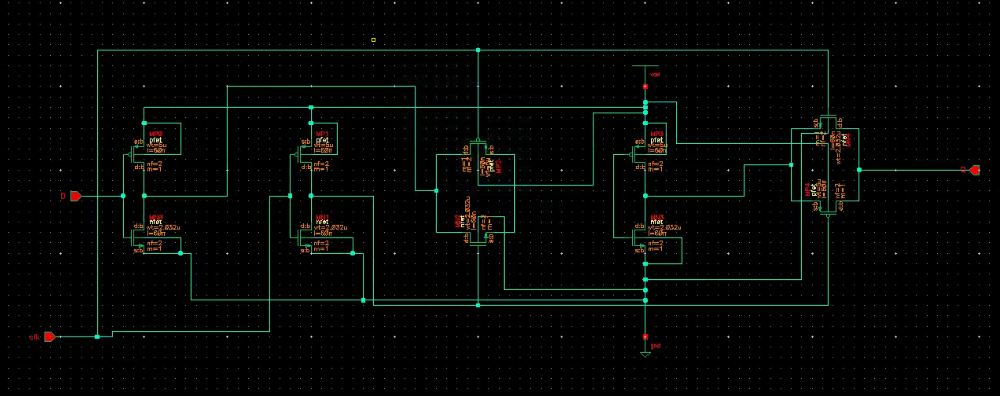

1BIT_FULL_ADDER Schematic

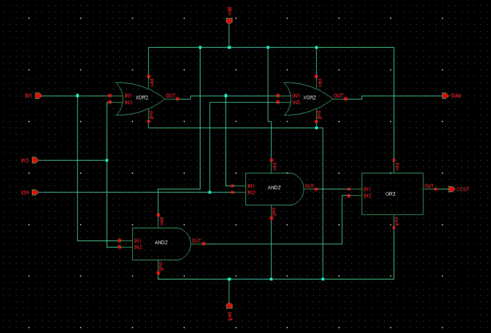

4BIT_ADD_SUB Schematic

4 (XOR + 1bit_fulladder)

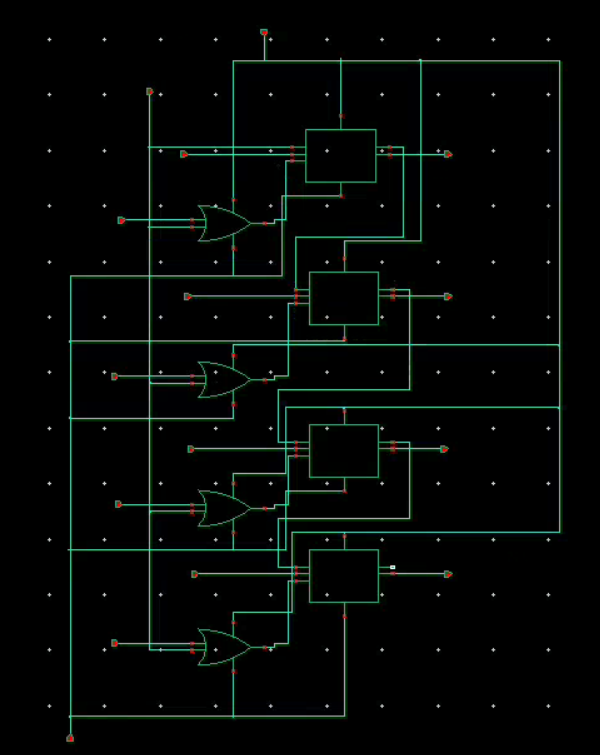

4BIT_ADD_SUB Output

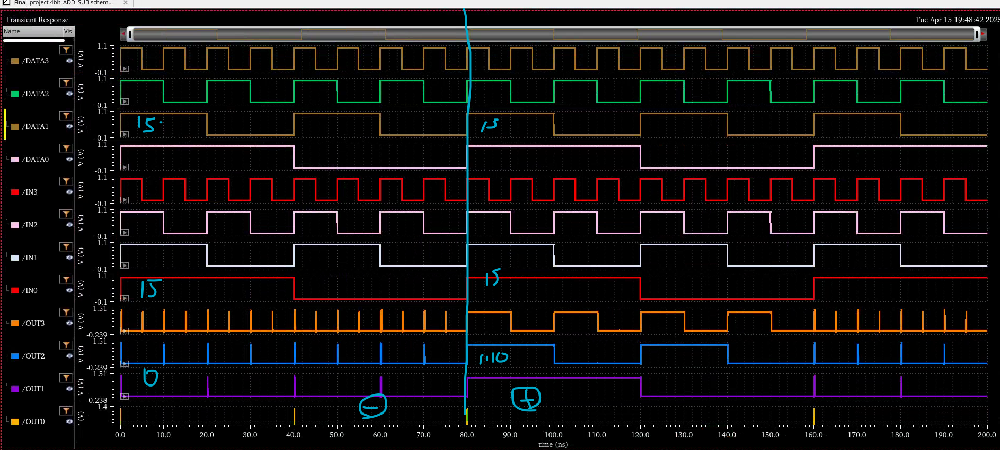
